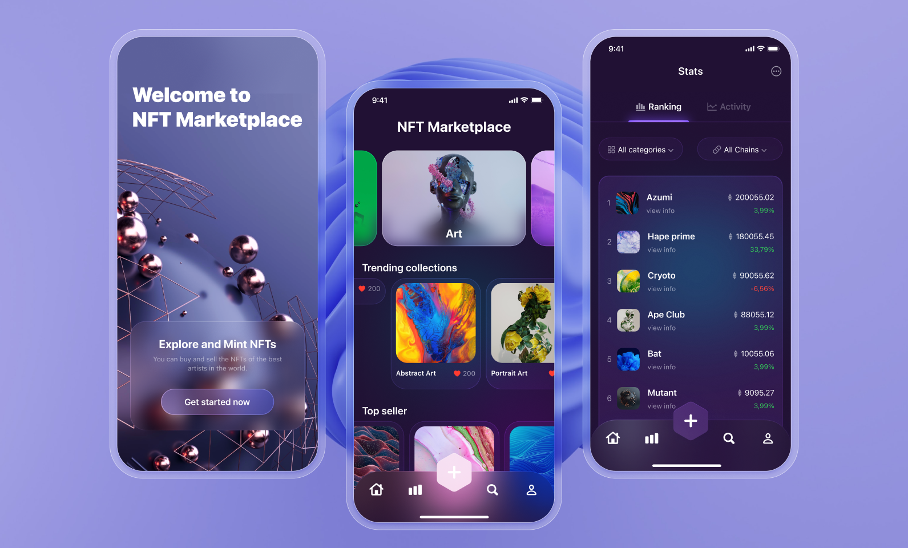

# NFT Marketplace UI 🚀

A modern, iOS-inspired user interface for an NFT marketplace  
built with Flutter and a minimal design, perfect for buying and selling NFTs.  
Enjoy a smooth user experience, glassmorphism effects,  
and a clean, mobile-friendly navigation.

---

## Technologies Used

- **Flutter** (Dart)
- Responsive, mobile-first design
- Glassmorphism effects
- Modern gradients and attractive color palette
- Custom Bottom Navigation Bar
- iOS-style bouncing scroll (BouncingScrollPhysics)
- Page and route management with Navigator

---

## Features

- Welcome screen with quick start button
- Trending NFTs and category showcase
- Top sellers and collections list
- Stats page with ranking, filters, and tabs
- iPhone-style status bar for a real mobile feel

---

## Getting Started

1. **Clone this repository:**
    ```bash
    git clone https://github.com/YourUsername/YourRepo.git
    ```

2. **Enter the project directory and install dependencies:**
    ```bash
    cd YourRepo
    flutter pub get
    ```

3. **Run the project:**
    ```bash
    flutter run
    ```

---

## Screenshots



---

## Hexagon Button (Sin & Cos Formula)

The floating action button in this UI is a perfect hexagon,  
drawn using the following Dart code with sine and cosine:

```dart
for (int i = 0; i < 6; i++) {
  final angle = (i * 60) * (pi / 180);
  final x = centerX + radius * cos(angle);
  final y = centerY + radius * sin(angle);
  if (i == 0) {
    path.moveTo(x, y);
  } else {
    path.lineTo(x, y);
  }
}
path.close();
```
## Developer
Mahdi Shabani

